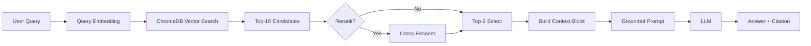

# Architecture — RAG Pipeline (Day 08 Lab)

> Template: Điền vào các mục này khi hoàn thành từng sprint.
> Deliverable của Documentation Owner.

## 1. Tổng quan kiến trúc

```
[Raw Docs]
    ↓
[index.py: Preprocess → Chunk → Embed → Store]
    ↓
[ChromaDB Vector Store]
    ↓
[rag_answer.py: Query → Retrieve → Rerank → Generate]
    ↓
[Grounded Answer + Citation]
```

**Mô tả ngắn gọn:**
> TODO: Mô tả hệ thống trong 2-3 câu. Nhóm xây gì? Cho ai dùng? Giải quyết vấn đề gì?

---

## 2. Indexing Pipeline (Sprint 1)

### Tài liệu được index
| File | Nguồn | Department | Số chunk |
|------|-------|-----------|---------|
| `policy_refund_v4.txt` | policy/refund-v4.pdf | CS | 6 |
| `sla_p1_2026.txt` | support/sla-p1-2026.pdf | IT | 5 |
| `access_control_sop.txt` | it/access-control-sop.md | IT Security | 8 |
| `it_helpdesk_faq.txt` | support/helpdesk-faq.md | IT | 6 |
| `hr_leave_policy.txt` | hr/leave-policy-2026.pdf | HR | 5 |

### Quyết định chunking

| Tham số | Giá trị | Lý do |
|---------|---------|-------|
| Chunk size | 400 tokens | Được cấu hình qua `CHUNK_SIZE = 400`, với quy ước ước lượng `1 token ≈ 4 ký tự`. Kích thước này nằm trong khoảng khuyến nghị 300–500 tokens, đủ lớn để giữ ngữ cảnh nhưng vẫn phù hợp cho retrieval. |
| Overlap | 80 tokens | Được cấu hình qua `CHUNK_OVERLAP = 80`. Overlap giúp bảo toàn ngữ nghĩa giữa các chunk liền kề, giảm nguy cơ mất thông tin khi nội dung bị cắt ở ranh giới paragraph hoặc section. |
| Chunking strategy | Heading-based + paragraph-based fallback | Tài liệu được tách trước theo heading dạng `=== Section ===`. Nếu một section còn quá dài, hệ thống tiếp tục tách theo paragraph; nếu paragraph vẫn vượt ngưỡng thì tách tiếp theo câu. Cách làm này ưu tiên ranh giới tự nhiên thay vì cắt cứng theo số token. |
| Metadata fields | `source`, `section`, `effective_date`, `department`, `access` | Metadata được trích xuất từ phần header của tài liệu và gắn vào từng chunk để hỗ trợ filter, kiểm tra độ mới của tài liệu, phân quyền truy cập và citation/debug khi inspect index. |

### Embedding model
- **Model**: OpenAI `text-embedding-3-small`
- **Vector store**: ChromaDB (`PersistentClient`)
- **Similarity metric**: Cosine
---

## 3. Retrieval Pipeline (Sprint 2 + 3)

### Baseline (Sprint 2)
| Tham số | Giá trị |
|---------|---------|
| Strategy | Dense (embedding similarity) |
| Top-k search | 10 |
| Top-k select | 3 |
| Rerank | Không |

### Variant (Sprint 3)
| Tham số | Giá trị | Thay đổi so với baseline |
|---------|---------|------------------------|
| Strategy | Hybrid (dense + sparse/BM25 với RRF) | Từ chỉ dùng dense sang kết hợp dense retrieval và keyword retrieval |
| Top-k search | 10 | Không đổi |
| Top-k select | 3 | Không đổi |
| Rerank | Không | Không bật rerank trong pipeline variant hiện tại |
| Query transform | Không | Chưa có query expansion / HyDE / decomposition; `transform_query()` vẫn là stub |

**Lý do chọn variant này:**
> Chọn **hybrid retrieval** vì đây là biến thể đã được implement hoàn chỉnh trong code và phù hợp với loại dữ liệu mục tiêu của bài lab. Dense retrieval mạnh khi câu hỏi được diễn đạt tự nhiên hoặc paraphrase, trong khi sparse/BM25 mạnh với exact term như mã lỗi, tên ticket, keyword ngắn hoặc viết tắt như `ERR-403`, `P1`, `refund`. Kết hợp hai hướng bằng **Reciprocal Rank Fusion (RRF)** giúp tăng recall mà không phải thay đổi phần generation hay prompt grounded của baseline.

### Giải thích chi tiết

- **Baseline Sprint 2** dùng `retrieve_dense()` để query ChromaDB bằng embedding similarity.
- `TOP_K_SEARCH = 10` và `TOP_K_SELECT = 3` được khai báo cố định ở phần config.
- Ở baseline, `use_rerank=False`, nên hệ thống chỉ lấy top-3 chunk đầu sau retrieval để đưa vào prompt.
- **Variant Sprint 3** khả dụng nhất trong code hiện tại là `retrieve_hybrid()`:
  - lấy kết quả từ `retrieve_dense()`
  - lấy thêm kết quả từ `retrieve_sparse()`
  - hợp nhất bằng **RRF**
- Hàm `rerank()` có tồn tại, nhưng đó là **phương án thay thế / optional**, chưa phải cấu hình variant mặc định đang được so sánh.
- Hàm `transform_query()` hiện chưa implement, nên chưa thể ghi là có query transformation trong variant thực tế.

### Tóm tắt quyết định

Variant được chọn trong code hiện tại là:

- **Dense baseline**
- **Hybrid variant**
- Giữ nguyên:
  - `top_k_search = 10`
  - `top_k_select = 3`
- Chưa bật:
  - rerank
  - query transformation

## 4. Generation (Sprint 2)

### Grounded Prompt Template

```text
Bạn là trợ lý RAG chỉ được phép trả lời từ context đã truy xuất.

Quy tắc:
1. Chỉ dùng thông tin có trong Context.
2. Nếu Context không đủ để trả lời, phải trả lời đúng cụm: "Không đủ dữ liệu".
3. Không suy đoán, không bịa thêm, không dùng kiến thức bên ngoài.
4. Khi trả lời được, phải trích dẫn ít nhất một citation dạng [1], [2], ...
5. Trả lời ngắn gọn, rõ ràng, cùng ngôn ngữ với câu hỏi.

Question: {query}

Context:
[1] {source} | {section} | score={score}
{chunk_text}

[2] ...

Answer:
```

### LLM Configuration

| Tham số | Giá trị |
|---------|---------|
| Model | `gpt-4o-mini` |
| Temperature | `0` |
| Max tokens | `300` |

### Giải thích cấu hình

- **Model**: code đặt `LLM_MODEL = os.getenv("LLM_MODEL", "gpt-4o-mini")`, nên mặc định đang dùng `gpt-4o-mini`.
- **Temperature = 0**: giúp output ổn định hơn cho đánh giá baseline, giảm dao động giữa các lần chạy.
- **Max tokens = 300**: trong hàm `call_llm()` code đang gọi `max_tokens=300`, không phải `512`.


---

> Dùng khi debug — kiểm tra lần lượt: index → retrieval → generation

| Failure Mode | Triệu chứng | Cách kiểm tra |
|-------------|-------------|---------------|
| Index lỗi | Retrieve về tài liệu cũ, sai metadata, hoặc thiếu chunk | Chạy `inspect_metadata_coverage()` để kiểm tra phân bố metadata và chunk thiếu `effective_date`; kiểm tra lại `source`, `department`, `access` |
| Chunking tệ | Chunk bị cắt giữa điều khoản, mất section, overlap không đủ | Chạy `list_chunks()` và đọc `Text preview`, đồng thời test `chunk_document()` trên 1 file mẫu |
| Retrieval lỗi | Không ra đúng nguồn mong đợi hoặc score quá thấp | Chạy `rag_answer(query, verbose=True)` để xem số candidates, top score, source của các chunk đầu; có thể so sánh thêm bằng `compare_retrieval_strategies(query)` |
| Generation lỗi | Answer không grounded, thiếu citation, hoặc không abstain khi thiếu dữ liệu | Kiểm tra `prompt` tạo từ `build_grounded_prompt()`, xem `chunks_used` trong kết quả `rag_answer()`, và đối chiếu answer với context block |
| Token overload | Context quá dài, dễ mất thông tin ở giữa prompt | Kiểm tra số chunk đưa vào prompt (`top_k_select`) và độ dài `context_block`; hiện code giới hạn mặc định top-3 chunk để giảm rủi ro này |

---

## 6. Diagram (tùy chọn)

> TODO: Vẽ sơ đồ pipeline nếu có thời gian. Có thể dùng Mermaid hoặc drawio.


